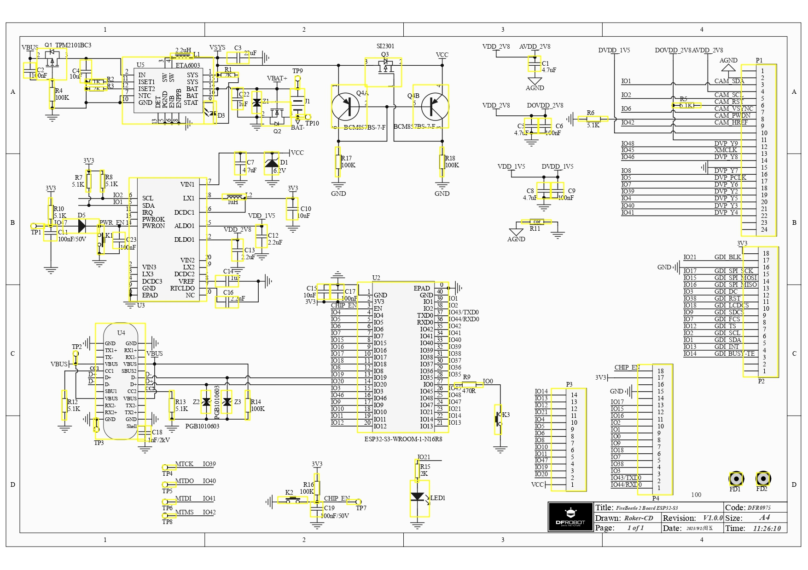
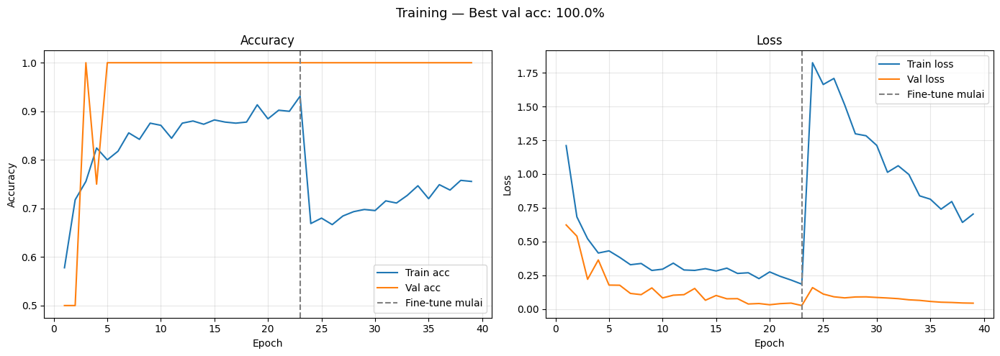

# Rancang Bangun Alat Klasifikasi Telur Berdasarkan Tekstur Cangkang Menggunakan ESP-32 S3 CAM Berbasis IoT

<div align="center">

**Tugas Akhir — Politeknik Negeri Sriwijaya**

Muhammad Reka Alviandi · NIM 062330701499

Jurusan Teknik Komputer · 2026

</div>

---

## Deskripsi

Sistem klasifikasi telur **on-device** yang mendeteksi kualitas cangkang telur (BAGUS / TIDAK BAGUS) secara real-time menggunakan kamera OV2640 dan model TFLite Micro yang berjalan langsung di ESP32-S3 — tanpa koneksi cloud. Pengguna mengakses antarmuka web melalui WiFi untuk melihat live preview kamera, mengumpulkan dataset, dan menjalankan inferensi.

---

## Hardware

| Komponen | Spesifikasi |
|---|---|
| Board | Freenove ESP32-S3-WROOM CAM (FNK0085, varian N16R8) |
| MCU | ESP32-S3 Dual-Core Xtensa LX7 @ 240 MHz |
| Flash | 16 MB (terdeteksi esptool) |
| PSRAM | 8 MB Octal (OPI) |
| Kamera | OV2640 2MP FOV 66.5° (onboard, selalu berdaya — tanpa AXP) |
| Penyimpanan | microSD 4 GB, FAT32 (allocation unit 16K), SDMMC 1-bit |
| LED | WS2812 RGB onboard (GPIO 48) |
| Daya | 5V / maks 2A (gunakan adaptor/port USB yang kuat) |

<div align="center">



*Skematik Rangkaian*

</div>

---

## Arsitektur Sistem

```
OV2640 (JPEG VGA 640×480 — tidak pernah berganti resolusi)
        │  live stream / download dataset
        ├─────────────────────────→  Web Browser (WiFi)
        │  frame VGA langsung               ↕ HTTP API
        ↓                          WebServer (Core 1 prio 1)
  JPEG decode → RGB888             WiFi event reconnect
  (rgbArena 921KB PSRAM)                   │
        ↓                                  │ /predict
  Scale nearest-neighbor               inferTrigSem
  VGA → 96×96                             ↓
        ↓                     Inference Task (Core 0 prio 5)
  Kuantisasi → INT8 tensor          MicroInterpreter
        ↓                           MobileNetV1 α=0.25
  TFLite Invoke                          │
        ↓                          inferDoneSem
  Output: BAGUS / TIDAK BAGUS            │
        ↓                                ↓
      LED indikator          JSON response → Browser
```

**Optimasi RTOS + PSRAM:**
- Tidak ada pergantian resolusi kamera → hemat ~160ms per inferensi
- `rgbArena` 921KB pre-alokasi di PSRAM (zero malloc/free saat inferensi)
- Inference task di Core 0 priority 5, WebServer di Core 1
- WiFi reconnect via event handler (tidak polling di loop)

**Spesifikasi model:** MobileNetV1 α=0.25, input 96×96 RGB INT8, ~315 KB

---

## Manajemen Memori — N16R8 Dimaksimalkan

Pembagian peran setiap jenis memori (16 MB flash + 8 MB PSRAM + 512 KB SRAM + SD 4 GB):

| Memori | Isi | Alasan |
|---|---|---|
| **Flash app — 2×6,25 MB (dual-OTA)** | Firmware | Update via web `/ota` tanpa kabel USB; slot kedua = rollback aman |
| **LittleFS — 3,43 MB** | Web UI + **model (primer)** | Semua yang dibutuhkan alat agar berfungsi **mandiri tanpa SD**; update per-file via `/fs/upload` (plugin uploader tidak diperlukan lagi) |
| **SD card — 4 GB** | `/dataset/` (sumber kebenaran), `predict_log.csv`, **backup model** | Data besar/tumbuh; backup model dipulihkan otomatis ke LittleFS saat boot |
| **NVS** | Pengaturan kamera (23 parameter OV2640) | Kecil, sering dibaca, tahan restart |
| **PSRAM — 8 MB OPI** | Frame buffer kamera 2×VGA, `rgbArena` 921 KB, buffer model ~315 KB | Buffer besar; bandwidth cukup untuk data gambar |
| **SRAM internal — 512 KB** | **Tensor arena** (bila muat, otomatis fallback PSRAM) | Akses jauh lebih cepat dari PSRAM (bus OPI) → inferensi lebih singkat |

**Model self-healing** — saat boot, salinan model di LittleFS dan SD disinkronkan dua arah:
LittleFS kosong (mis. habis ditimpa plugin uploader) → dipulihkan dari SD; SD kosong/beda →
di-backup dari LittleFS. Model praktis tidak bisa hilang kecuali keduanya dihapus.

**Tensor arena dua-tahap** — interpreter dialokasikan dulu di PSRAM untuk mengukur
kebutuhan arena yang sebenarnya (`arena_used_bytes`), lalu bila SRAM internal masih
menyisakan ≥120 KB untuk WiFi + HTTP, interpreter dibangun ulang dengan arena
pas-ukuran di SRAM. Lokasi arena terlihat di tab **⚙️ Sistem** dan `/model_info`.

---

## Preprocessing & Hasil Training

<div align="center">


*Pipeline preprocessing dataset: capture → resize 96×96 → augmentasi*

</div>

<div align="center">



*Hasil training: Accuracy & Loss curve (Fase 1 head + Fase 2 fine-tune)*

</div>

---

## Struktur Direktori

```
klasifikasiTelur_ESP32_S3_CAM/
├── README.md
├── .github/workflows/
│   └── train.yml                      # Workflow training otomatis (Actions)
├── dataset/                           # Dataset sinkron dari SD (via web UI)
├── model/                             # Hasil training CI: egg_model.tflite + info
├── docs/
│   ├── schematic.jpg                  # Skematik rangkaian
│   ├── prepocessing dataset.png       # Pipeline preprocessing
│   └── trainResult.png                # Kurva training
├── DataCollector/
│   └── DataCollector.ino              # Pengumpul dataset awal (legacy)
├── training/
│   ├── KlasifikasiTelur_Training.ipynb  # Google Colab notebook (alternatif)
│   ├── train.py                         # Script training (lokal & CI)
│   ├── requirements.txt
│   └── dataset/                         # Foto telur lokal (tidak di-track)
└── EggClassifierV2/                   # ← Firmware utama
    ├── EggClassifierV2.ino
    └── data/                          # LittleFS — web interface
        ├── index.html
        ├── app.js
        └── style.css
```

---

## Setup & Cara Pakai (EggClassifierV2)

### 1. Install Library (Arduino IDE → Tools → Manage Libraries)

| Library | Author |
|---|---|
| `TensorFlowLite_ESP32` | tanakamasayuki |

> Board Freenove tidak memakai AXP313A — kamera selalu berdaya, library DFRobot tidak diperlukan.

### 2. Konfigurasi Board (Tools)

| Pengaturan | Nilai |
|---|---|
| Board | `ESP32S3 Dev Module` |
| Flash Size | `16MB (128Mb)` |
| **Partition Scheme** | **`Default 16MB with spiffs (6.25MB APP/3.43MB SPIFFS)`** ← wajib, dual-OTA |
| PSRAM | `OPI PSRAM` |
| CPU Frequency | `240MHz` |
| USB CDC On Boot | `Enabled` |

> ⚠️ **Ganti partition scheme = flash via USB sekali** dan seluruh isi flash terhapus
> (LittleFS + NVS — pengaturan kamera kembali default; **SD card tidak tersentuh**).
> Setelah boot pertama, buka `http://telur.local` → muncul **halaman pemulihan**
> tertanam di firmware: upload `index.html`, `app.js`, `style.css` dari folder
> `EggClassifierV2/data/` langsung dari browser. Model dipulihkan otomatis dari
> backup SD. Setelah itu **semua update berikutnya lewat WiFi** (tab ⚙️ Sistem):
> firmware via OTA, web UI via upload per-file — kabel USB tidak diperlukan lagi.

### 3. Set WiFi Credentials

Edit di `EggClassifierV2.ino`:
```cpp
#define WIFI_SSID  "nama_wifi_kamu"
#define WIFI_PASS  "password_wifi"
```

### 4. Upload Firmware (USB — hanya pertama kali)

Klik **Upload (→)**, tunggu selesai, buka Serial Monitor 115200.

### 5. Upload Web Interface ke LittleFS (via browser, tanpa plugin)

Boot pertama LittleFS masih kosong — buka `http://telur.local`, firmware
otomatis menampilkan **halaman pemulihan**: pilih `index.html`, `app.js`,
`style.css` dari folder `EggClassifierV2/data/` → Upload → halaman dimuat ulang
sebagai web UI lengkap.

Update web UI selanjutnya: tab **⚙️ Sistem → Update Web UI** (atau dari terminal:
`for f in EggClassifierV2/data/*; do curl -F "file=@$f" http://telur.local/fs/upload; done`).

> Plugin "ESP32 Sketch Data Upload" tetap bisa dipakai, tapi **tidak disarankan** —
> plugin menimpa seluruh partisi LittleFS. Kalaupun terlanjur, model dipulihkan
> otomatis dari backup SD saat boot berikutnya.

### 5b. Update Firmware Selanjutnya — OTA via Web (tanpa USB)

1. Arduino IDE: **Sketch → Export Compiled Binary** (Ctrl+Alt+S)
2. Web UI → tab **⚙️ Sistem → Update Firmware (OTA)** → pilih
   `EggClassifierV2.ino.bin` (di `EggClassifierV2/build/esp32.esp32.esp32s3/`)
3. Tunggu progress 100% → alat restart sendiri dengan firmware baru

### 6. Akses Web Interface

Setelah board terhubung WiFi, buka browser:
```
http://telur.local       ← via mDNS (Windows perlu Bonjour)
http://<IP_ADDRESS>      ← IP tampil di Serial Monitor
```

### 7. Pasang Model

Model dipasang dari tab **🚀 Training** (satu pintu):
jalankan pipeline penuh, atau klik **"Pasang Model Ini ke Alat"** pada kartu
Model Terakhir di GitHub. Board restart otomatis; model tersimpan di **LittleFS**
(primer) dengan **backup otomatis di SD card** — keduanya saling memulihkan saat
boot, sehingga model selamat dari upload ulang LittleFS maupun SD dicabut.

> Untuk model dari luar pipeline (mis. hasil Colab), gunakan endpoint langsung:
> `curl -F "model=@egg_model.tflite" http://telur.local/upload_model`

---

## Web Interface

### Tab Dataset — Kumpulkan Data (`1`)

| Aksi | Shortcut |
|---|---|
| Capture foto BAGUS | Klik tombol hijau atau tekan `G` |
| Capture foto CACAT | Klik tombol merah atau tekan `B` |

Dengan SD card terpasang, foto tersimpan langsung di alat (`/dataset/good_0001.jpg` dst.)
dan counter dihitung dari isi SD — tidak hilang saat ganti browser.
Tanpa SD card, otomatis jatuh ke mode lama: foto diunduh ke PC.

### Tab Kelola — CRUD Dataset di SD (`2`)

Galeri seluruh foto dataset di SD card dengan operasi lengkap:

| Operasi | Cara |
|---|---|
| **Create** | Upload JPEG dari PC (multi-file) sebagai BAGUS / CACAT |
| **Read** | Galeri thumbnail (filter Semua/Bagus/Cacat, lazy-load 24/batch), ketuk untuk ukuran penuh |
| **Update** | 🔁 pindah label good ↔ bad (file di-rename di SD) |
| **Delete** | 🗑️ hapus foto (dengan konfirmasi) |

Saat tab ini terbuka, **preview kamera dimatikan** (polling berhenti + area preview
disembunyikan) agar bandwidth ESP32 fokus memuat foto dari SD.
Saat sinkron training berikutnya, perubahan ikut diterapkan ke repo GitHub —
foto yang dihapus di SD juga dihapus dari repo (SD = sumber kebenaran).

### Tab Training — Pipeline Otomatis (`3`)

Preview kamera dimatikan di tab ini; sebagai gantinya tampil ringkasan dataset
(jumlah foto BAGUS / CACAT + pemakaian SD).

Satu tombol **"Sinkron + Training + Pasang Model"** menjalankan seluruh pipeline:

1. **Sinkron** — foto baru di SD diunggah browser ke folder `dataset/` repo GitHub
2. **Training** — workflow GitHub Actions (`train.yml`) melatih MobileNetV1 α=0.25 INT8
3. **Pasang** — model hasil training diunduh dan dipasang otomatis ke ESP32

Konfigurasi sekali di kartu **Pengaturan GitHub** (owner, repo, branch, fine-grained PAT).
Token hanya disimpan di `localStorage` browser — tidak pernah menyentuh ESP32.

### Tab Prediksi — Klasifikasi Real-time (`4`)

| Aksi | Shortcut |
|---|---|
| Jalankan klasifikasi | Klik tombol biru atau tekan `C` |

Output: label (BAGUS / TIDAK BAGUS), skor sigmoid, tingkat keyakinan, waktu inferensi.

### Tab Kamera — Pengaturan Sensor (`5`)

Kontrol penuh semua parameter OV2640: brightness, contrast, saturation, efek khusus,
kualitas JPEG, white balance (auto/manual + mode), exposure (AEC auto/manual, AE level),
gain (AGC, gain ceiling), koreksi pixel/gamma/lensa, mirror & flip, dan color bar.

Semua perubahan langsung terlihat di preview dan **tersimpan permanen di NVS** —
tidak hilang saat alat dimatikan.

> 💡 **Tips akurasi:** atur pencahayaan tetap, matikan Auto Exposure dan Auto White
> Balance, lalu gunakan setting yang sama saat mengumpulkan dataset dan prediksi.
> Sensor yang konsisten = model yang akurat.

### Tab Sistem — Monitor & Update via Web (`6`)

Preview kamera dimatikan di tab ini. Empat kartu:

| Kartu | Fungsi |
|---|---|
| **Memori & Penyimpanan** | Bar pemakaian SRAM internal, PSRAM, LittleFS, SD + info firmware, partisi, lokasi model & tensor arena, RSSI, uptime |
| **Update Firmware (OTA)** | Upload `.ino.bin` lewat WiFi — tanpa kabel USB |
| **Update Web UI** | Upload `index.html` / `app.js` / `style.css` ke LittleFS per-file — tanpa plugin |
| **Log Prediksi** | Riwayat klasifikasi dari `predict_log.csv` di SD (waktu NTP WIB, label, skor, durasi) — unduh CSV untuk lampiran laporan, atau hapus |

---

## API Endpoints

| Method | Endpoint | Deskripsi |
|---|---|---|
| GET | `/` | Web interface utama |
| GET | `/capture` | JPEG frame live (untuk preview & download dataset) |
| GET | `/predict` | Jalankan inferensi → JSON `{label, score, time_ms, good}` |
| GET | `/model_info` | Status model `{loaded, size_kb, arena_kb}` |
| POST | `/upload_model` | Upload file `.tflite` → LittleFS + backup SD → restart |
| GET | `/sd/info` | Status SD `{mounted, good, bad, used_mb, total_mb}` |
| POST | `/sd/capture?label=good\|bad` | Capture → simpan JPEG ke SD `/dataset/` |
| GET | `/sd/list` | Daftar file dataset di SD (JSON) |
| GET | `/sd/file?name=...` | Stream satu foto dataset dari SD |
| POST | `/sd/delete?name=...` | Hapus satu foto dataset |
| POST | `/sd/relabel?name=...` | Pindah label good ↔ bad (rename di SD) |
| POST | `/sd/upload?label=good\|bad` | Upload JPEG dari PC ke dataset SD |
| GET | `/camera/get` | JSON semua parameter sensor OV2640 |
| POST | `/camera/set?var=...&val=...` | Set parameter kamera → tersimpan di NVS |
| POST | `/camera/reset` | Reset semua setting kamera → default pabrik (restart) |
| GET | `/sys/info` | Statistik memori/penyimpanan/firmware (tab Sistem) |
| POST | `/ota` | Update firmware via web (multipart `.bin`, butuh partisi dual-OTA) |
| POST | `/fs/upload` | Upload file web UI ke LittleFS (pengganti plugin uploader) |
| GET | `/log` | CSV log prediksi dari SD (`?tail=1` → 16 KB terakhir) |
| POST | `/log/clear` | Hapus log prediksi |

---

## Training

### Cara 1 — Otomatis via Web UI (GitHub Actions) ← direkomendasikan

Repo target (`Keyzoo0/EggClassifier` @ `main`) sudah tertanam di web UI — tidak ada
form pengaturan. Saat pertama kali klik Train, browser meminta **fine-grained PAT**
sekali (GitHub → Settings → Developer settings → Fine-grained tokens → akses repo ini
saja, permission **Contents: Read & Write** + **Actions: Read & Write**), lalu token
tersimpan di browser. Tombol 🔑 di tab Training untuk menggantinya.

> Token sengaja tidak ditanam di kode: token yang ter-push ke repo akan otomatis
> dicabut oleh GitHub secret scanning.

Selanjutnya cukup satu klik **"Sinkron + Training + Pasang Model"**.
Training berjalan di runner GitHub (gratis untuk repo publik, ±20–40 menit CPU),
hasilnya di-commit sebagai `model/egg_model.tflite` + `model/model_info.json`,
lalu otomatis dipasang ke alat. Progres bisa dipantau di tab Actions GitHub.

### Cara 2 — Manual via Google Colab

Buka notebook [`training/KlasifikasiTelur_Training.ipynb`](training/KlasifikasiTelur_Training.ipynb) di Google Colab,
lalu pasang model hasilnya via `curl -F "model=@egg_model.tflite" http://telur.local/upload_model`.

### Pipeline Training (kedua cara sama)

1. **Dataset** — format nama file: `good_0001.jpg`, `bad_0001.jpg`, dst.
2. **Augmentasi** — flip, brightness, contrast, saturation, hue, crop-resize
3. **Fase 1** — Train head only (base MobileNetV1 frozen)
4. **Fase 2** — Fine-tune 20 layer terakhir (lr=1e-5)
5. **Konversi INT8** — full integer quantization, representative dataset
6. **Output** — `egg_model.tflite` (CI: + `model_info.json` berisi akurasi & metadata)

### Hasil Training (Dataset 25 foto)

| Metrik | Fase 1 | Fase 2 |
|---|---|---|
| Best Val Accuracy | 100% | 100% |
| Early Stopping | Epoch 23 | Epoch 16 |

> ⚠️ Val accuracy 100% pada dataset 25 foto tidak menjamin performa di dunia nyata. **Target minimal 100 foto per kelas** untuk akurasi yang representatif.

---

## LED Indikator (WS2812 RGB onboard)

| Kondisi | LED |
|---|---|
| Booting / Connecting WiFi | Biru kedip (250ms) |
| WiFi terhubung | Hijau redup solid |
| WiFi putus / reconnecting | Biru kedip |
| Hasil klasifikasi BAGUS | Hijau terang 1,5 detik |
| Hasil klasifikasi TIDAK BAGUS | Merah terang 1,5 detik |

---

## Pin Mapping — Freenove FNK0085

**Kamera (profil `CAMERA_MODEL_ESP32S3_EYE`):**

| Signal | GPIO |
|---|---|
| XCLK | 15 |
| SDA (SCCB) | 4 |
| SCL (SCCB) | 5 |
| D0–D7 (Y2–Y9) | 11, 9, 8, 10, 12, 18, 17, 16 |
| VSYNC | 6 |
| HREF | 7 |
| PCLK | 13 |

**SD card (SDMMC 1-bit) & LED:**

| Signal | GPIO |
|---|---|
| SD CMD | 38 |
| SD CLK | 39 |
| SD D0 | 40 |
| WS2812 RGB LED | 48 |

> Tidak ada konflik pin kamera ↔ SD card di board ini — keduanya aktif bersamaan.

## Status Pengembangan

| Fase | Deskripsi | Status |
|---|---|---|
| Phase 1 | Verifikasi hardware — camera test | ✅ DONE |
| Phase 2 | DataCollector — web UI + LittleFS | ✅ DONE |
| Phase 3 | Pengumpulan dataset | ⚠️ 25 foto (target 100+/kelas) |
| Phase 4 | Training MobileNetV1 α=0.25 INT8 | ✅ DONE |
| Phase 5 | EggClassifierV2 — firmware + web + dual-core | ✅ DONE |
| Phase 6 | Optimasi RTOS + PSRAM — zero-alloc inference | ✅ DONE |
| Phase 7 | Migrasi Freenove FNK0085 + SD card + pipeline training GitHub Actions | ✅ DONE |
| Phase 8 | Maksimalkan N16R8: partisi dual-OTA 16MB, OTA via web, web UI tanpa plugin, model self-healing LittleFS↔SD, arena di SRAM, log prediksi SD | 🔄 Testing hardware |

---

## Referensi

- [Freenove ESP32-S3-WROOM Board (FNK0085)](https://github.com/Freenove/Freenove_ESP32_S3_WROOM_Board)
- [Dokumentasi FNK0085](https://docs.freenove.com/projects/fnk0085/en/latest/)
- [esp32-camera — Espressif](https://github.com/espressif/esp32-camera)
- [TensorFlowLite_ESP32 — tanakamasayuki](https://github.com/tanakamasayuki/Arduino_TensorFlowLite_ESP32)
- [MobileNets — Howard et al.](https://arxiv.org/abs/1704.04861)
