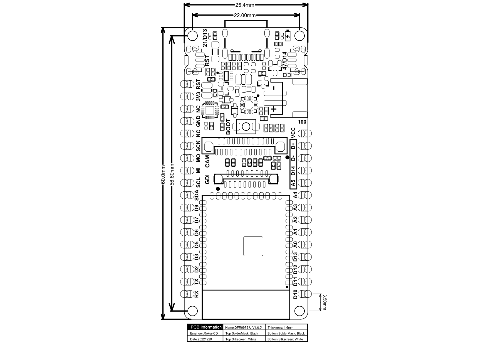

# Rancang Bangun Alat Klasifikasi Telur Berdasarkan Tekstur Cangkang Menggunakan ESP-32 S3 CAM Berbasis IoT

<div align="center">

**Tugas Akhir — Politeknik Negeri Sriwijaya**

Muhammad Reka Alviandi · NIM 062330701499

Jurusan Teknik Komputer · 2026

</div>

---

## Deskripsi

Sistem klasifikasi telur **on-device** yang mendeteksi kualitas cangkang telur (BAGUS / TIDAK BAGUS) secara real-time menggunakan kamera OV2640 dan model TFLite Micro yang berjalan langsung di ESP32-S3 — tanpa koneksi cloud. Pengguna mengakses antarmuka web melalui WiFi untuk melihat live preview kamera, mengumpulkan dataset, dan menjalankan inferensi.

---

## Hardware

| Komponen | Spesifikasi |
|---|---|
| Board | DFRobot FireBeetle 2 ESP32-S3 N16R8 v1.0 |
| MCU | ESP32-S3 Dual-Core Xtensa LX7 @ 240 MHz |
| Flash | 16 MB |
| PSRAM | 8 MB Octal (OPI) |
| Kamera | OV2640 2MP (onboard, via AXP313A) |

<div align="center">



*Dimensi Board DFRobot FireBeetle 2 ESP32-S3*

</div>

<div align="center">


*Skematik Rangkaian*

</div>

---

## Arsitektur Sistem

```
OV2640 (JPEG VGA 640×480 — tidak pernah berganti resolusi)
        │  live stream / download dataset
        ├─────────────────────────→  Web Browser (WiFi)
        │  frame VGA langsung               ↕ HTTP API
        ↓                          WebServer (Core 1 prio 1)
  JPEG decode → RGB888             WiFi event reconnect
  (rgbArena 921KB PSRAM)                   │
        ↓                                  │ /predict
  Scale nearest-neighbor               inferTrigSem
  VGA → 96×96                             ↓
        ↓                     Inference Task (Core 0 prio 5)
  Kuantisasi → INT8 tensor          MicroInterpreter
        ↓                           MobileNetV1 α=0.25
  TFLite Invoke                          │
        ↓                          inferDoneSem
  Output: BAGUS / TIDAK BAGUS            │
        ↓                                ↓
      LED indikator          JSON response → Browser
```

**Optimasi RTOS + PSRAM:**
- Tidak ada pergantian resolusi kamera → hemat ~160ms per inferensi
- `rgbArena` 921KB pre-alokasi di PSRAM (zero malloc/free saat inferensi)
- Inference task di Core 0 priority 5, WebServer di Core 1
- WiFi reconnect via event handler (tidak polling di loop)

**Spesifikasi model:** MobileNetV1 α=0.25, input 96×96 RGB INT8, ~315 KB

---

## Preprocessing & Hasil Training

<div align="center">


*Pipeline preprocessing dataset: capture → resize 96×96 → augmentasi*

</div>

<div align="center">


*Hasil training: Accuracy & Loss curve (Fase 1 head + Fase 2 fine-tune)*

</div>

---

## Struktur Direktori

```
klasifikasiTelur_ESP32_S3_CAM/
├── README.md
├── docs/
│   ├── dimesion.jpg                   # Dimensi board FireBeetle 2
│   ├── schematic.jpg                  # Skematik rangkaian
│   ├── prepocessing dataset.png       # Pipeline preprocessing
│   └── trainResult.png                # Kurva training
├── CameraTest/
│   └── CameraTest.ino                 # Uji kamera (Phase 1)
├── DataCollector/
│   └── DataCollector.ino              # Pengumpul dataset awal
├── training/
│   ├── KlasifikasiTelur_Training.ipynb  # Google Colab notebook
│   ├── train.py                         # Script training lokal
│   ├── requirements.txt
│   └── dataset/                         # Foto telur (tidak di-track)
└── EggClassifierV2/                   # ← Firmware utama
    ├── EggClassifierV2.ino
    └── data/                          # LittleFS — web interface
        ├── index.html
        ├── app.js
        └── style.css
```

---

## Setup & Cara Pakai (EggClassifierV2)

### 1. Install Library (Arduino IDE → Tools → Manage Libraries)

| Library | Author |
|---|---|
| `DFRobot_AXP313A` | DFRobot |
| `TensorFlowLite_ESP32` | tanakamasayuki |

### 2. Konfigurasi Board (Tools)

| Pengaturan | Nilai |
|---|---|
| Board | `ESP32S3 Dev Module` |
| Flash Size | `16MB (128Mb)` |
| **Partition Scheme** | **`Huge APP (3MB No OTA/1MB SPIFFS)`** ← wajib |
| PSRAM | `OPI PSRAM` |
| CPU Frequency | `240MHz` |
| USB CDC On Boot | `Enabled` |

### 3. Set WiFi Credentials

Edit di `EggClassifierV2.ino`:
```cpp
#define WIFI_SSID  "nama_wifi_kamu"
#define WIFI_PASS  "password_wifi"
```

### 4. Upload Web Interface ke LittleFS

1. Install plugin **ESP32 Sketch Data Upload** untuk Arduino IDE 2.x:
   - Download dari [lorol/arduino-esp32fs-plugin](https://github.com/lorol/arduino-esp32fs-plugin)
   - Salin ke folder `tools/` di direktori Arduino
2. Buka sketch `EggClassifierV2/EggClassifierV2.ino`
3. **Tools → ESP32 Sketch Data Upload** → pilih LittleFS
4. Tunggu sampai upload selesai

### 5. Upload Firmware

Klik **Upload (→)**, tunggu selesai, buka Serial Monitor 115200.

### 6. Akses Web Interface

Setelah board terhubung WiFi, buka browser:
```
http://telur.local       ← via mDNS (Windows perlu Bonjour)
http://<IP_ADDRESS>      ← IP tampil di Serial Monitor
```

### 7. Upload Model

1. Jalankan training di Google Colab → download `egg_model.tflite`
2. Di web interface → tab **Prediksi** → bagian **Model TFLite**
3. Pilih file `egg_model.tflite` → klik **Upload & Aktifkan Model**
4. Board restart otomatis, model tersimpan permanen di flash

---

## Web Interface

### Tab Dataset — Kumpulkan Data

| Aksi | Shortcut |
|---|---|
| Capture foto BAGUS | Klik tombol hijau atau tekan `G` |
| Capture foto CACAT | Klik tombol merah atau tekan `B` |

Foto langsung diunduh ke PC sebagai `good_0001.jpg`, `bad_0001.jpg`, dst.
Counter tersimpan di `localStorage` browser sehingga tidak reset saat refresh.
Pindahkan file ke folder dataset, lalu jalankan training di Google Colab.

### Tab Prediksi — Klasifikasi Real-time

| Aksi | Shortcut |
|---|---|
| Jalankan klasifikasi | Klik tombol biru atau tekan `C` |

Output: label (BAGUS / TIDAK BAGUS), skor sigmoid, tingkat keyakinan, waktu inferensi.

---

## API Endpoints

| Method | Endpoint | Deskripsi |
|---|---|---|
| GET | `/` | Web interface utama |
| GET | `/capture` | JPEG frame live (untuk preview & download dataset) |
| GET | `/predict` | Jalankan inferensi → JSON `{label, score, time_ms, good}` |
| GET | `/model_info` | Status model `{loaded, size_kb, arena_kb}` |
| POST | `/upload_model` | Upload file `.tflite` → LittleFS → restart |

---

## Training — Google Colab

Buka notebook [`training/KlasifikasiTelur_Training.ipynb`](training/KlasifikasiTelur_Training.ipynb) di Google Colab.

### Pipeline Training

1. **Upload dataset** — ZIP dari PC atau salin dari Google Drive
   - Format nama file: `good_0001.jpg`, `bad_0001.jpg`, dst.
2. **Augmentasi** — flip, brightness, contrast, saturation, hue, crop-resize (×30 per epoch)
3. **Fase 1** — Train head only (60 epoch, base MobileNetV1 frozen)
4. **Fase 2** — Fine-tune 20 layer terakhir (40 epoch, lr=1e-5)
5. **Konversi INT8** — full integer quantization, representative dataset
6. **Generate** `egg_model.h` — download lalu copy ke folder sketch

### Hasil Training (Dataset 25 foto)

| Metrik | Fase 1 | Fase 2 |
|---|---|---|
| Best Val Accuracy | 100% | 100% |
| Early Stopping | Epoch 23 | Epoch 16 |

> ⚠️ Val accuracy 100% pada dataset 25 foto tidak menjamin performa di dunia nyata. **Target minimal 100 foto per kelas** untuk akurasi yang representatif.

---

## LED Indikator

| Kondisi | LED |
|---|---|
| Booting / Connecting WiFi | Kedip cepat (250ms) |
| WiFi terhubung | Menyala solid |
| WiFi putus / reconnecting | Kedip cepat |

---

## Pin Mapping Kamera

| Signal | GPIO |
|---|---|
| XCLK | 45 |
| SDA (SCCB) | 1 |
| SCL (SCCB) | 2 |
| D0–D7 | 39, 40, 41, 4, 7, 8, 46, 48 |
| VSYNC | 6 |
| HREF | 42 |
| PCLK | 5 |

## Status Pengembangan

| Fase | Deskripsi | Status |
|---|---|---|
| Phase 1 | Verifikasi hardware — camera test | ✅ DONE |
| Phase 2 | DataCollector — web UI + LittleFS | ✅ DONE |
| Phase 3 | Pengumpulan dataset | ⚠️ 25 foto (target 100+/kelas) |
| Phase 4 | Training MobileNetV1 α=0.25 INT8 | ✅ DONE |
| Phase 5 | EggClassifierV2 — firmware + web + dual-core | ✅ DONE |
| Phase 6 | Optimasi RTOS + PSRAM — hapus SD, zero-alloc inference | ✅ DONE |

---

## Referensi

- [DFRobot FireBeetle 2 Wiki](https://wiki.dfrobot.com/SKU_DFR0975_FireBeetle_2_Board_ESP32_S3)
- [esp32-camera — Espressif](https://github.com/espressif/esp32-camera)
- [TensorFlowLite_ESP32 — tanakamasayuki](https://github.com/tanakamasayuki/Arduino_TensorFlowLite_ESP32)
- [MobileNets — Howard et al.](https://arxiv.org/abs/1704.04861)
